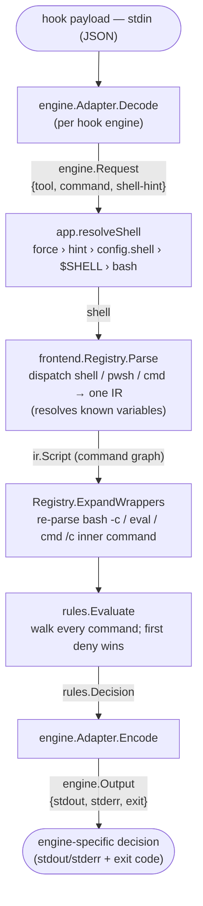

# Architecture

`llm-tool-killer` (`ltk`) is invoked as a **pre-tool hook** by an LLM coding
agent. It reads the proposed shell command on stdin, decides whether to allow or
deny it, and—on a denial—hands the model a reason and a suggested alternative so
it can retry the right way (e.g. "don't run `go test`, use `just test`").



Two interfaces carry all the variation:

- **`frontend.Frontend`** — one shell dialect → the IR. The rule engine and
  adapters never depend on a concrete parser.
- **`engine.Adapter`** — one hook protocol → `engine.Request`/`engine.Output`.
  The core never speaks a specific engine's wire format.

`engine.Output{Stdout, Stderr, ExitCode}` is deliberately general so that adding
an engine is *additive*: no existing signature changes.

## Shell resolution

The shell to parse with is *resolved*, not sniffed from command text. The LLM
picks a **tool**, and the tool largely determines the shell. Precedence:

1. `--shell` flag — operator force / escape hatch.
2. Adapter hint — a per-call, tool-derived shell (authoritative when present).
3. `defaults.shell` in the YAML — explicit operator config.
4. `$SHELL` — the user's login shell (Claude Code's Bash tool runs in it).
5. `bash` — final fallback.

Content sniffing is intentionally **not** used: `$(...)` and `${...}` are
ambiguous between bash and PowerShell, so guessing from text is unreliable.

## Rules

Rules are matched against the IR, never against raw text. The matching model —
program/positional/option args and its cross-shell portability — is
documented in [RULES.md](RULES.md).

## Understanding (catching trivial workarounds)

Rather than block "scary" constructs, the pipeline *understands* them before
matching:

- **Variable resolution** (shell frontend, `mvdan.cc/sh/v3/expand`): words are
  expanded against the process environment (the hook inherits the callee's env)
  plus assignments seen earlier in the script, so `t=test; go $t` resolves to
  `go test`. Command/process substitutions are captured as nested scripts (so
  their commands are still matched) but never executed; unknown values expand to
  empty and are not matched.
- **Wrapper re-parsing** (`Registry.ExpandWrappers`): the inner command of a
  trivial wrapper — `bash -c "…"`, `eval "…"`, `cmd /c "…"`, `pwsh -Command "…"` —
  is re-parsed (by the inner shell, via the registry) into `Nested`, so a denied
  command can't be smuggled through it. Bounded recursion handles nested wrappers.

> Scope is **cooperative** ("LLM wrangling"), not a security boundary. If an agent
> is told to evade a rule it can re-implement, recompile-and-rename, or symlink
> the tool — see the README. Deeper intent-based detection is aspirational. For
> hard isolation, run the agent in a sandbox/container.

---

# Engine compatibility

All target engines expose a deny-capable pre-execution hook that runs an
external program reading JSON on stdin and returning a decision. The differences
each `engine.Adapter` absorbs:

| Engine | Hook event | Shell signal | Deny mechanism | Status |
|---|---|---|---|---|
| **Claude Code** | `PreToolUse` | `tool_name`: `Bash` → user's `$SHELL`; `PowerShell` → pwsh | JSON `permissionDecision: deny` on **stdout**, exit **0** | **implemented** |
| **Codex CLI** | `PreToolUse` (`~/.codex/hooks.json`) | always `bash` (runs `bash -lc`) | JSON deny on **stdout**; "any deny wins" | planned |
| **Gemini CLI** | `BeforeTool` (settings.json `hooks` + matcher) | `run_shell_command`: `bash` on Unix; `cmd`/`pwsh` on Windows | reason on **stderr**, exit **2** (or JSON) | planned |

### How Codex/Gemini will slot in (no rework needed)

- **Adapter only.** Each is a new `engine.Adapter` (`Decode`/`Encode`) registered
  in `engine.Get`. The `Output{Stdout,Stderr,ExitCode}` shape already expresses
  Gemini's exit-2/stderr path and Codex's stdout/exit-0 path.
- **Shell hint, not `$SHELL`.** Codex and Gemini force a fixed shell
  (`bash -lc` / `bash -c`), so their adapters emit a **strong `bash` hint**
  (precedence step 2), which bypasses the `$SHELL` detection that Claude's Bash
  tool relies on. Gemini-on-Windows emits `cmd`/`pwsh` (or defers to
  `defaults.shell`). `internal/shellenv` is shared for any `$SHELL` parsing they
  do need.
- **No frontend work.** Codex/Gemini commands are still POSIX-shell or pwsh, so
  they reuse the existing frontends.

### Verified Claude Code PreToolUse contract (May 2026)

- **Input (stdin):** `{ session_id, transcript_path, cwd, permission_mode,
  hook_event_name: "PreToolUse", tool_name, tool_input }`. For `Bash`,
  `tool_input` is just `{ "command": "..." }` — no shell field, no description.
- **Deny:** stdout
  `{"hookSpecificOutput":{"hookEventName":"PreToolUse","permissionDecision":"deny","permissionDecisionReason":"…"}}`
  with exit `0`. The reason is fed back to the model.
- **Allow / pass-through:** emit nothing, exit `0`. (`permissionDecision:"allow"`
  would *skip the prompt* but not bypass deny rules — we don't use it.)
- **Registration (`settings.json`):**
  ```json
  {
    "hooks": {
      "PreToolUse": [
        { "matcher": "Bash",
          "hooks": [ { "type": "command",
                       "command": "${CLAUDE_PROJECT_DIR}/bin/ltk evaluate --config ${CLAUDE_PROJECT_DIR}/.ltk.yaml" } ] }
      ]
    }
  }
  ```
  Matchers are literal tool names with `|` alternation (e.g. `Bash|PowerShell`),
  not a general regex. `$CLAUDE_PROJECT_DIR` is available to the command.

---

# Not yet built

- **Codex** and **Gemini** engines (above) — `engine.Engine` implementations,
  registered in `engines()`; `manage` and `evaluate` already dispatch
  polymorphically, so each is purely additive.
- More `match` operators.

Done: POSIX-shell frontend, real **pwsh** frontend (native parser), **cmd**
frontend (hand-written lexer), rule engine, Claude Code engine (`evaluate` +
`manage install`/`uninstall`).
