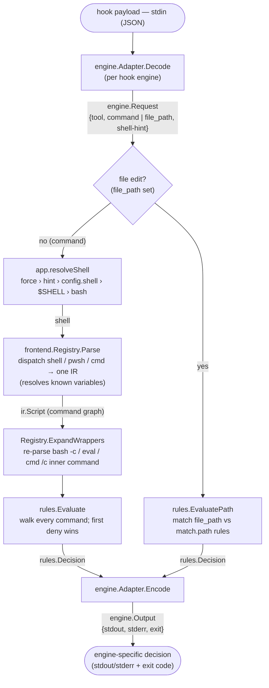

# Architecture

`llm-tool-killer` (`ltk`) is invoked as a **pre-tool hook** by an LLM coding
agent. It reads the proposed action on stdin — a **shell command** (Bash/
PowerShell tool) or a **file edit** (Edit/Write/MultiEdit/NotebookEdit tool) —
decides whether to allow or deny it, and—on a denial—hands the model a reason and
a suggested alternative so it can retry the right way (e.g. "don't run `go test`,
use `just test`", or "don't hand-edit `VERSION`").

The two paths share the engine and rule model but diverge at evaluation: a
command is parsed to an IR and matched against **command rules**; a file edit
carries a `file_path` and is matched against **`match.path` rules** (no shell
parsing). See the file-edit branch below the diagram.



**File-edit branch.** When `engine.Request.FilePath` is set (the agent invoked an
editing tool), `app.Decide` skips shell resolution and parsing entirely and calls
`rules.EvaluatePath`, which matches the path against the `match.path` rules (first
deny wins, same `mode`/`confirm`/`message`/`suggest` semantics as command rules).
The `@submodules` sentinel is resolved against `.gitmodules` (`internal/scm`) and
expanded to one directory pattern per submodule before evaluation, keeping the
`rules` package free of filesystem I/O. Path globbing is doublestar (`**`), tried
against basename, full path, and an implicit `**/` prefix so repo-relative
patterns match the absolute paths the tools pass — see [RULES.md](RULES.md#matching-file-edits-matchpath).

Two interfaces carry all the variation:

- **`frontend.Frontend`** — one shell dialect → the IR. The rule engine and
  adapters never depend on a concrete parser.
- **`engine.Adapter`** — one hook protocol → `engine.Request`/`engine.Output`.
  The core never speaks a specific engine's wire format.

`engine.Output{Stdout, Stderr, ExitCode}` is deliberately general so that adding
an engine is *additive*: no existing signature changes.

## Shell resolution

The shell to parse with is *resolved*, not sniffed from command text. The LLM
picks a **tool**, and the tool largely determines the shell. Precedence:

1. `--shell` flag — operator force / escape hatch.
2. Adapter hint — a per-call, tool-derived shell (authoritative when present).
3. `defaults.shell` in the YAML — explicit operator config.
4. `$SHELL` — the user's login shell (Claude Code's Bash tool runs in it).
5. `bash` — final fallback.

Content sniffing is intentionally **not** used: `$(...)` and `${...}` are
ambiguous between bash and PowerShell, so guessing from text is unreliable.

## Rules

Rules are matched against the IR, never against raw text. The matching model —
program/positional/option args and its cross-shell portability — is
documented in [RULES.md](RULES.md).

## Understanding (catching trivial workarounds)

Rather than block "scary" constructs, the pipeline *understands* them before
matching:

- **Variable resolution** (shell frontend, `mvdan.cc/sh/v3/expand`): words are
  expanded against the process environment (the hook inherits the callee's env)
  plus assignments seen earlier in the script, so `t=test; go $t` resolves to
  `go test`. Command/process substitutions are captured as nested scripts (so
  their commands are still matched) but never executed; unknown values expand to
  empty and are not matched.
- **Wrapper re-parsing** (`Registry.ExpandWrappers`): the inner command of a
  trivial wrapper — `bash -c "…"`, `eval "…"`, `cmd /c "…"`, `pwsh -Command "…"` —
  is re-parsed (by the inner shell, via the registry) into `Nested`, so a denied
  command can't be smuggled through it. Bounded recursion handles nested wrappers.

> Scope is **cooperative** ("LLM wrangling"), not a security boundary. If an agent
> is told to evade a rule it can re-implement, recompile-and-rename, or symlink
> the tool — see the README. Deeper intent-based detection is aspirational. For
> hard isolation, run the agent in a sandbox/container.

---

# Engine compatibility

**Claude Code and Antigravity CLI (`agy`) are implemented today.** Codex is
**planned, not built** — the design accommodates it (see below), but no
adapter exists yet. If you want it, vote 👍 on the tracking issue:
[Codex #2](https://github.com/ctxloom/llm-tool-killer/issues/2).
(Gemini CLI support, formerly issue #1, was retargeted at Antigravity when
Google discontinued Gemini CLI in June 2026.)

All target engines expose a deny-capable pre-execution hook that runs an
external program reading JSON on stdin and returning a decision. The differences
each `engine.Adapter` absorbs:

| Engine | Hook event | Shell signal | Deny mechanism | Status |
|---|---|---|---|---|
| **Claude Code** | `PreToolUse` | `tool_name`: `Bash` → user's `$SHELL`; `PowerShell` → pwsh | JSON `permissionDecision: deny` on **stdout**, exit **0** | **✅ implemented** |
| **Antigravity CLI** | `PreToolUse` (`.agents/hooks.json` `hooks` + matcher) | `run_command`/`execute_command`: always `bash` | JSON `{"decision":"deny","reason":…}` on **stdout**, exit **0** | **✅ implemented** |
| **Codex CLI** | `PreToolUse` (`~/.codex/hooks.json`) | always `bash` (runs `bash -lc`) | JSON deny on **stdout**; "any deny wins" | 🗳️ planned — [vote #2](https://github.com/ctxloom/llm-tool-killer/issues/2) |

### How Codex will slot in (no rework needed)

- **Adapter only.** A new `engine.Adapter` (`Decode`/`Encode`) registered in
  `engine.Get`. The `Output{Stdout,Stderr,ExitCode}` shape already expresses
  Codex's stdout/exit-0 path.
- **Shell hint, not `$SHELL`.** Codex forces a fixed shell (`bash -lc`), so its
  adapter emits a **strong `bash` hint** (precedence step 2), which bypasses
  the `$SHELL` detection that Claude's Bash tool relies on — exactly the path
  the Antigravity adapter exercises today. `internal/shellenv` is shared for
  any `$SHELL` parsing it does need.
- **No frontend work.** Codex commands are still POSIX-shell, so they reuse the
  existing frontends.

### Verified Claude Code PreToolUse contract (May 2026)

- **Input (stdin):** `{ session_id, transcript_path, cwd, permission_mode,
  hook_event_name: "PreToolUse", tool_name, tool_input }`. For `Bash`,
  `tool_input` is just `{ "command": "..." }` — no shell field, no description.
- **Deny:** stdout
  `{"hookSpecificOutput":{"hookEventName":"PreToolUse","permissionDecision":"deny","permissionDecisionReason":"…"}}`
  with exit `0`. The reason is fed back to the model.
- **Allow / pass-through:** emit nothing, exit `0`. (`permissionDecision:"allow"`
  would *skip the prompt* but not bypass deny rules — we don't use it.)
- **Registration (`settings.json`):**
  ```json
  {
    "hooks": {
      "PreToolUse": [
        { "matcher": "Bash",
          "hooks": [ { "type": "command",
                       "command": "${CLAUDE_PROJECT_DIR}/bin/ltk evaluate --config ${CLAUDE_PROJECT_DIR}/.ltk.yaml" } ] }
      ]
    }
  }
  ```
  Matchers are literal tool names with `|` alternation (e.g. `Bash|PowerShell`),
  not a general regex. `$CLAUDE_PROJECT_DIR` is available to the command.

### Verified Antigravity PreToolUse contract (agy v1.0.7, June 2026)

The wire types live in `github.com/ctxloom/antigravity` (the org-shared agy
module); ltk's adapter consumes them rather than redefining the protocol.

- **Input (stdin):** `{ artifactDirectoryPath, conversationId, stepIdx,
  toolCall: { name, args }, transcriptPath, workspacePaths }` — camelCase
  envelope, PascalCase arg keys. `run_command`/`execute_command` carry
  `args.CommandLine` + `args.Cwd`; `write_to_file`/`replace_file_content`
  carry `args.TargetFile`. The hook process runs with cwd
  `<workspace>/.agents` and `ANTIGRAVITY_CONVERSATION_ID` in its environment.
- **Deny:** stdout `{"decision":"deny","reason":"…"}` with exit `0`. The model
  receives the reason verbatim ("Tool call denied with reason: …").
- **Allow / pass-through:** emit nothing, exit `0`.
- **Fail-open warning:** a hook that exits non-zero does NOT block the tool —
  agy logs the failure and proceeds. Denial must be the well-formed decision
  object, never an exit code.
- **Shell:** `run_command` executes via **bash** regardless of `$SHELL`
  (verified `echo $0` → `bash` on a zsh host) → strong `bash` hint.
- **Registration (`.agents/hooks.json`, project-level only):**
  ```json
  {
    "hooks": {
      "PreToolUse": [
        { "matcher": "run_command|execute_command|write_to_file|replace_file_content",
          "hooks": [ { "type": "command",
                       "command": "ltk evaluate --engine antigravity --config .ltk.yaml" } ] }
      ]
    }
  }
  ```
  The matcher is a regex over agy tool names (`.*` works). **No global
  registration:** `~/.gemini/antigravity-cli/hooks.json` is silently ignored,
  and a hooks.json under `~/.gemini/` or `~/.gemini/config/` hangs headless
  `agy -p` before any hook executes — `--global` install therefore errors.
  agy may prompt to trust a newly seen hook on first interactive run
  (`~/.gemini/trusted_hooks.json`); headless `-p` ran untrusted workspace
  hooks without prompting in v1.0.7.

---

# Not yet built

- **Codex** ([#2](https://github.com/ctxloom/llm-tool-killer/issues/2))
  engine (above) — an `engine.Engine` implementation registered in `engines()`;
  `manage` and `evaluate` already dispatch polymorphically, so it is purely
  additive. **Vote 👍 on the issue to prioritize.**
- More `match` operators.

Done: POSIX-shell frontend, real **pwsh** frontend (native parser), **cmd**
frontend (hand-written lexer), rule engine, Claude Code engine, Antigravity
engine (`evaluate` + `manage install`/`uninstall` for both), **file-edit
(`match.path`) rules** — full-glob (doublestar `**`) matching, directory
subtrees (`vendor/`), and the `@submodules` sentinel that blocks edits inside
every git submodule, with the shipped defaults guarding `.gitmodules` and
submodule contents.

The shape of the whole system is one idea: every shell dialect lowers into one
IR, and everything downstream — understanding, rule matching, engine I/O —
speaks only that IR. Adding a shell or an engine is additive, never a rewrite.
If you remember one thing, remember that seam.
